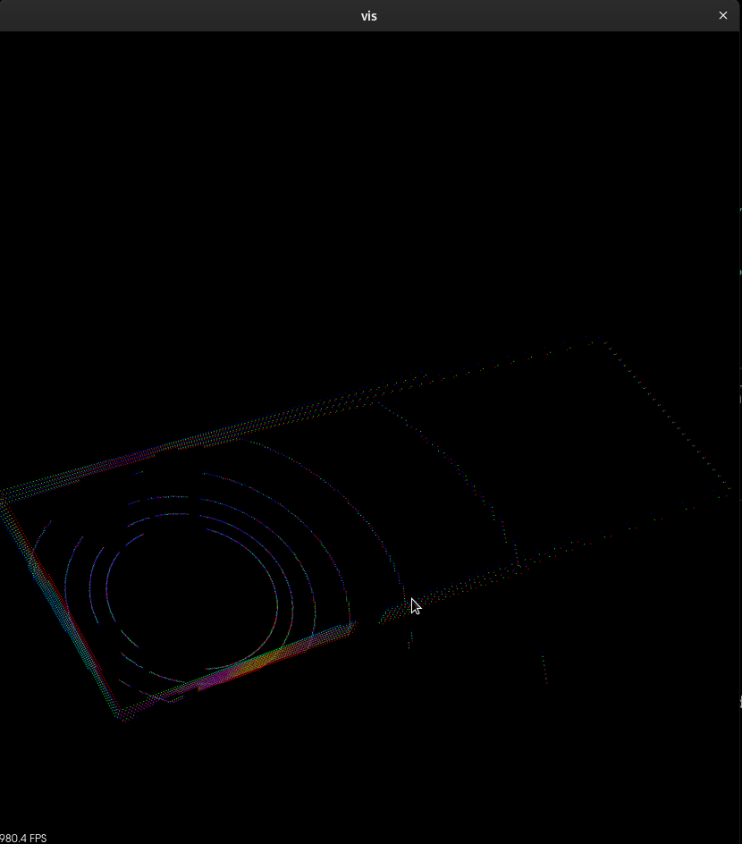

# PCL ICP
Standalone executable performing PCL Normal Distributions Transform and GICP registrations

### Build and run
```
git clone pcl-registration
cd pcl-registration
mkdir build && cd build && cmake .. && make
./align  ../data/16961.280000000.pcd ../data/16961.804000000.pcd
--- pcl::GICP ---
single alignment taken time: 53[ms]
fitness: 0.0455552

--- pcl::NDT ---
single alignment taken time: 43[ms]
fitness: 0.0714274
```

